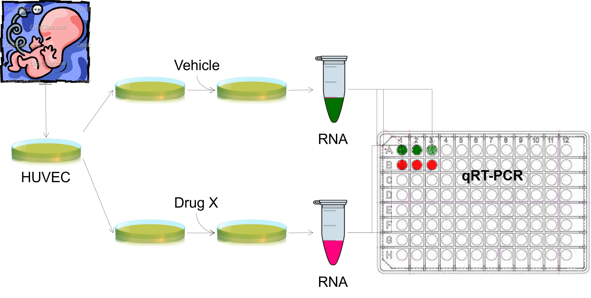
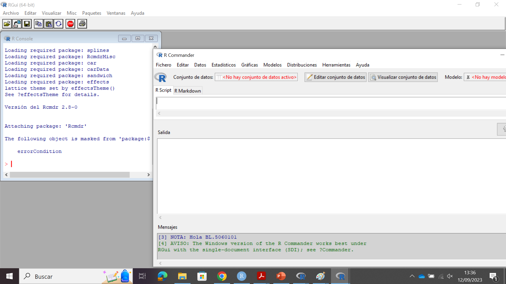
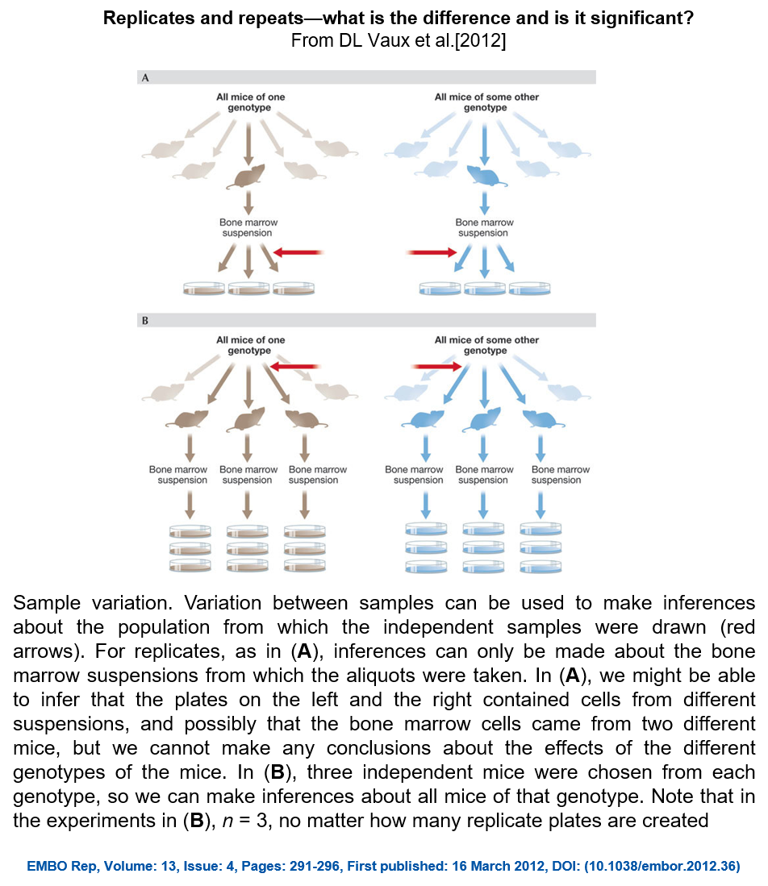
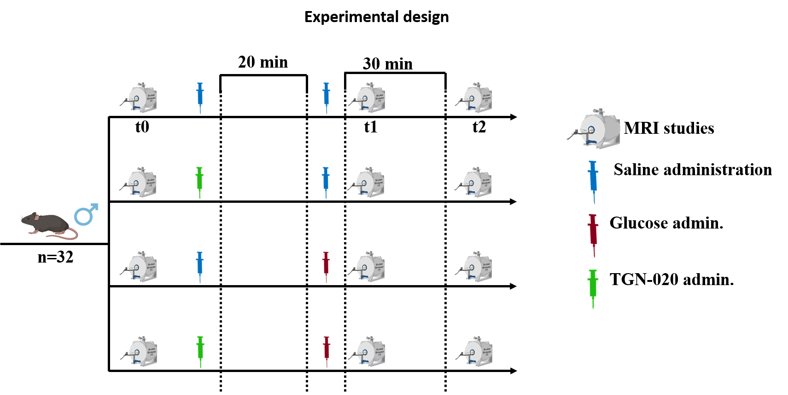
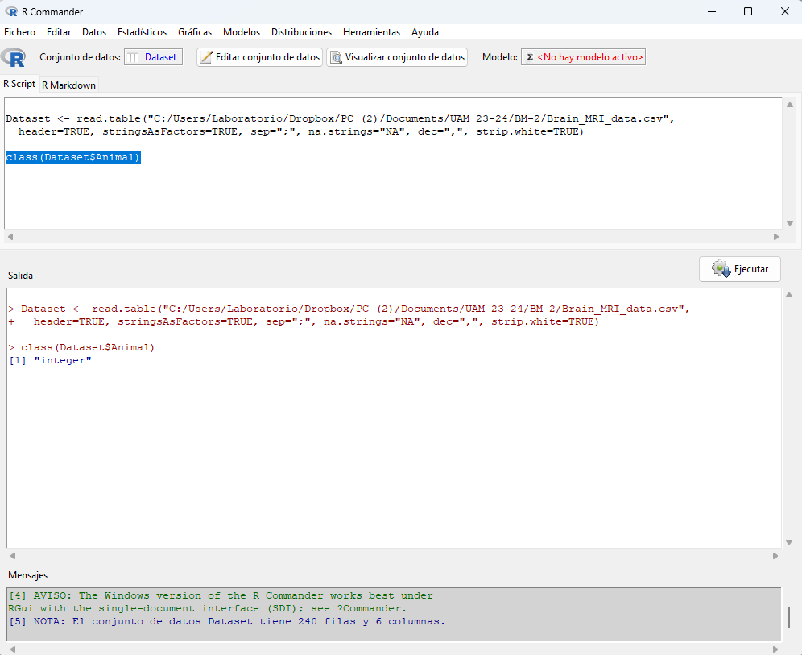
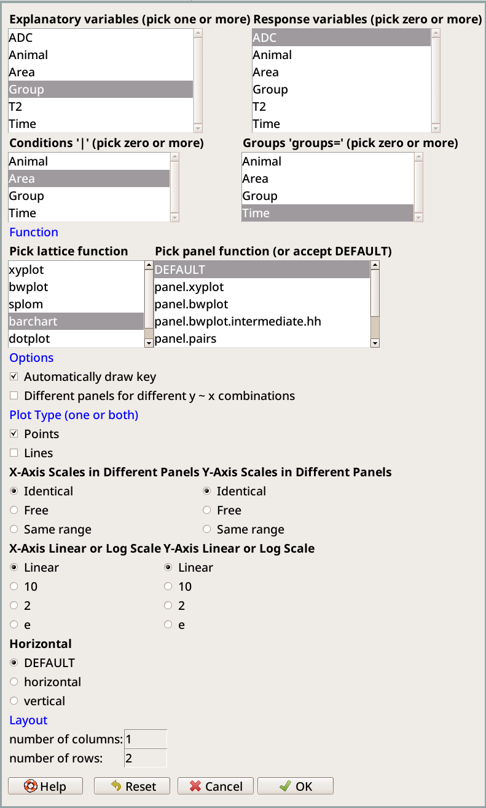
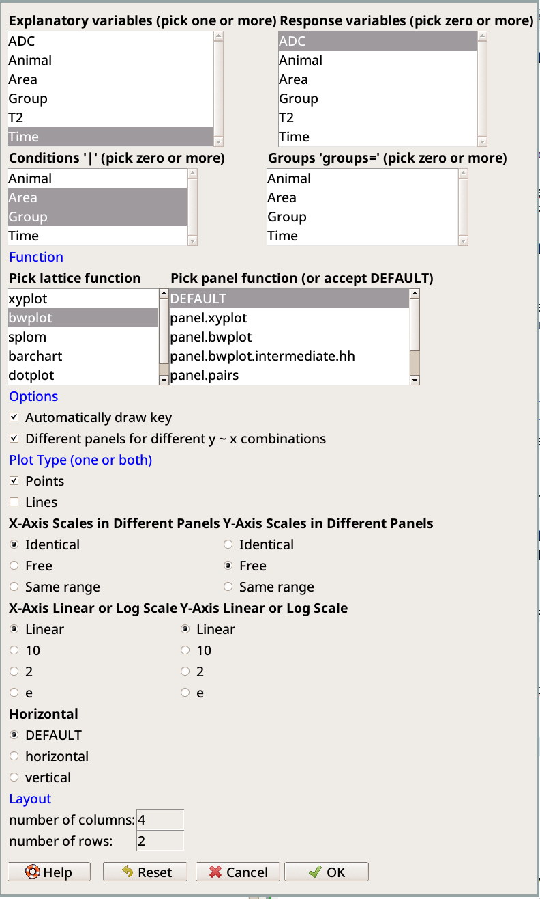
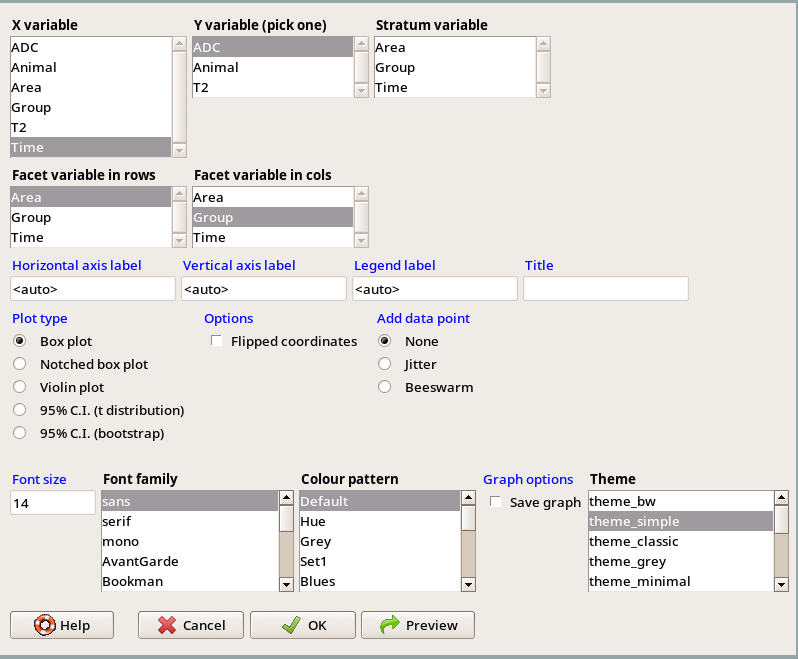
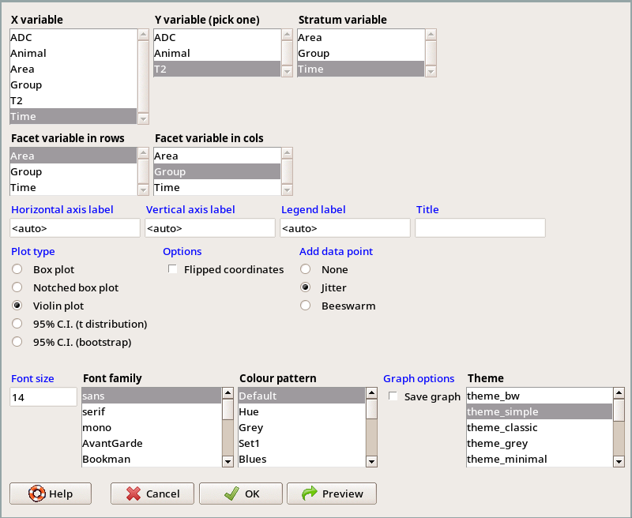
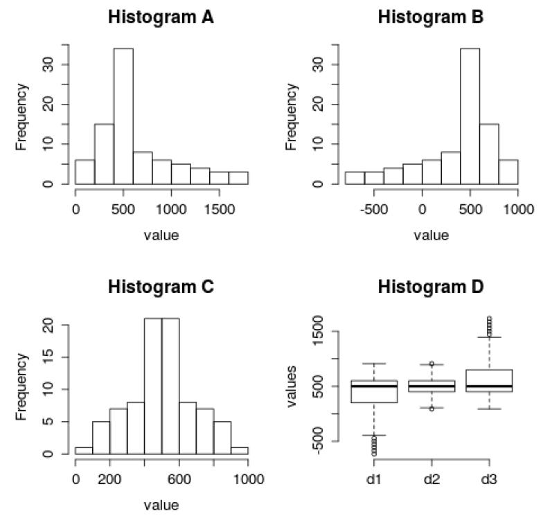

```{r setup, include= FALSE}
knitr::opts_chunk$set(echo = TRUE)
a <- getwd()
setwd(a)

library(car)
library(ggplot2)
library(Rcmdr)
library(RcmdrMisc)
```

<!-- What we will cover today/what you can expect to learn today -->

<!-- 1. Use R: read data and do plots -->
<!--    - sophisticated plots -->
<!--     - original data or of summary statistics -->
<!--     - reflect they features of the experimantal design -->
<!--     - appropriate for the question and data -->
<!--    - being able to deal with possibly annoying formatting issues -->


<!-- 2. Extracting the key experimental design features from the description -->
<!--    - Decide what type of plots you want -->
<!--      - data and/or summary statistics -->
<!--      - type of plots -->
<!--        - conditioning plots -->
<!--        - scale of the axes (mainly y-axis) -->
<!--        - repeated observations of the same individual -->


# **Data and graphs**

In this lesson, we are going to use R to arrange experimental data and perform some qualitative assessments, such as plots, and **descriptive statistics**, using real experimental data. In descriptive statistics, the data is summarized in different ways that try to display, or shown, it main features, such as its minimum and maximum, distribution, measures of location (mean, median, ...) and spread (variance, IQR ---interquartile range---, etc). Descriptive statistics is distinguished from **inferential statistics** (or inductive statistics), frequently used in experimental research, by the aim of descriptive statistics of **summarizing a sample**. In inferential  statistics, the data set of a specific sample (probably such as the type of data you obtained in your "TFG"), is used to learn about the population that the sample of data is thought to represent, conduct hypothesis testing, etc.

> Notice the difference between **sample** and **population**. Do you understand it? As an example, think of all the adult human population in Europe. A potential sociological research group might want to answer the following question: are people born during first six months of the year  more intelligent that those born on the second half of the year?. We can not perform IQ tests to **all** the adult European population, but we can take a smaller sample (for example, those of you attending to this class), and perform IQ tests. Once we have the results, we could obtain descriptive statistics values of our **sample**, such as the mean value, the maximum, minimum, median, etc, on each subgroup of you (by subgroup I mean here either born during the first six months, or the second half). Such results would give us information regarding the characteristics of the IQ tests of those of you here, **the sample** or descriptive statistics, but we would not be inferring the results to the European **population**. If we (hypothetically) performed a statistical t-test between the IQ values of the two subgroups of this sample, however, we would be relaying on a probability distribution theory, and entering in the world of inferential statistics (we will see it in Lessons 2,3,4).

**We will go to through following concepts**

+ Understanding experimental designs
+ Types of variables and how to represent them
+ Measures of center or location, spread and error
+ Difference between biological and technical replicates

**Regarding R usage, we will specifically learn to:**

+ Read data
+ Subset and rearrange data sets
+ Transform data
+ Make different types of graphs

Remember that R is used here to facilitate your learning process of applied statistics, you will not be examined of your R skills.

# Case 1: qPCR (from Prof. Luis del Peso's lab)
You investigate the effect of drug X on EFNA3 mRNA levels using human vascular endothelial cells (HUVEC) as a model. To this end, you seed two culture plates with HUVEC from the same donor and treat one plate with the drug and the other with vehicle alone. Then, following the standard procedures in your lab, you extract total RNA from both culture plates and determine transcript abundance by RT-qPCR in three aliquots from each RNA sample (see Figure \@ref(fig:exp-design-luis)). The experiment shows a clear effect of drug on EFNA3 mRNA level, but your supervisor is unconvinced claiming that you must validate this result in additional independent experiments. Why? you already have three replicates, aren’t they enough? Taking their advice you repeat the whole experiment three more times in different dates and using each time a new set of reagents and independent batches of cells from different donors. So you end up having 4 experiments x 3 qRT/PCR replicates =12 determinations for EFNA3 transcript in each condition (control and drug). A lot of data, good job, time to show your results to your supervisor...wait! How are you going to process this data? should you plot all 12 data points? What is the “n” (sample size) of your experiment?

Does it really matter? If so, why?

```{r exp-design-luis, fig.cap =  "Experimental design of Case 1", fig.align= "center", out.width="70%", echo=FALSE}

```

A simple scheme of the experimental design, that one of us (Ramon) draw to make sure they were understanding the key features of the design, is shown in Figure \@ref(fig:exp-design-luis-one-donor).


```{r exp-design-luis-one-donor, fig.cap =  "Experimental design of Case 1, single donor.", fig.align= "center", out.width="70%", echo=FALSE}
knitr::include_graphics("design_one_donor.pdf")
```

The above is for one donor. The scheme with the four donors is shown in Figure \@ref(fig:exp-design-luis-four-donors-mean); the rightmost columns show one possible way of indexing the observations and the average of the three replicates; that is not relevant now, but will be handy later.

```{r exp-design-luis-four-donors-mean, fig.cap =  "Experimental design of Case 1, four donors.", fig.align= "center", out.width="80%", echo=FALSE}
knitr::include_graphics("design_four_donors_mean.pdf")
```


**Wait a minute: Variables**: How many variables do we have in this experiment? Can you detect any differences betweem them?

There are two main types of variables: **numerical**, (what we record is a number that represent a measurable quantity, e.g. height of an individual, the pg of mRNA per cell, the value of a magnetic resonance image on a pixel) and **categorical**, (what we record is a qualitative characteristic, e.g. the color of eyes, gender, brain region). The different values that a categorical variable can take are referred to as levels (e.g. the categorical variable brain region in our example has only two levels, hippocampus or cortex). The levels can show a natural order (e.g. level of education: elementary school, high school, college graduate, PhD); in this case they are termed ordinal categorical. Categorical variables can also be unordered (our example of brain region) and then we call them nominal categorical variables (or just categorical). Numerical variables can be continuous (e.g. temperature) or discrete (e.g. number of siblings). Note that the label for some categorical variables are numbers (e.g. zip codes), which can mislead us to classify them as numerical. As a rule of thumb, with numerical variables it is sensible to add, subtract, or take averages with their values. In contrast, it does not make sense to apply arithmetic operations to categorical variables (what would be the meaning of adding or computing the average of two zip codes?).


## Reading the data

We will now load the dataset corresponding to **case 1**.

Many researchers use spreadsheet software such as MS office Excel to process data and generate graphs. Thus, chances are you’ll receive results in some of the file types generated by these software packages, such as “.xls” or “.xlsx” or "ods" files. However, these kind of files are not universally readable by other software packages. For example, R cannot directly read them (but it can if we use one of the several pacakges for readin xls files into R). Fortunately, almost all spreadsheet software packages can also save data in a plain text format in which individual data values in columns are separated by commas, hence is name “comma separated value” and extension name “.csv”. The main advantage of this format is that it can be read by almost any software package. Here are the steps you have to follow to save data in csv format (in other software packages will be very similar):

1. Open the file in Excel or LibreOffice or Gnumeric or whatever you use as your spreadsheet program.
2. Save it as .csv

You might want to set how columns are actually separated (by "," or by ";", or by tabs,  etc) and, in some places, like Spain, whether the decimal period is saved as "." or as ",". If your spreadsheet program does not allow for this, no big deal, since you can configure how R interprets these setting when importing (see below).

You are done. If you open the file with any text editor you’ll see rows of numbers, each row corresponding to one in the original file, delimited by commas. The comma separated values keep the same ordering as in the columns in the original file. Note that we can export data in this format using any delimiter instead of commas, which can be useful in some cases. In this regard, tabs are commonly used as delimiters in text files instead of commas.

Note that, for this lesson, we already provide you with the csv files. If you want to see how saving from a spreadsheet is done, ask for it in class.


Let us load the data from the qPCR_data.csv file. This data set contains the results of all four experiments  arranged in three columns: experiment, treatment, EFN3A_levels. Note that data is already arranged as a data matrix, (i.e. “correct” way). If you've used R before, you'll know how to do this. Otherwise, we'll use R Commander.


```{r Rfigures, fig.cap =  "Rgui interface (left) and Rcommander window (right)", fig.align= "center", echo=FALSE}

```


(Note: if you run R Commander from R Studio, not the usual R interface, the output seems to always be redirected to the R Studio console, so there is no lower split in R Commander with "Output" or "Salida". This is not a problem; by the way, you can always force all output to be redirected to the R console from the R Commander options.)


### Using R commander
1. Open an R session through the Rgui interface. In the console, type: library(Rcmdr). If is correctly installed, a new window should open that looks like Figure \@ref(fig:Rfigures).
2. In the menu bar choose **Data–>Import data–>from text file**: Make sure you choose “Import data” and not use the “Load dataset” instead (see number 1 in 1). Before selecting the file, a window appears in which we need to specify several characteristics of the file, including the field separator (comma, white space...) and the decimal-point (comma or dots) (pay attention to selecting the appropriate ones). Finally, we select file “qPCR_data.csv” from the directory were you downloaded it to.

3. Give a descriptive name to your data (e.g. qPCRdata) and make sure you indicate the appropriate delimiter (comma, tabs, white space,...). Finally, **indicate whether the decimal point character is a dot or a comma**.

<!-- Note: it is ; as separator and , as decimal -->

4. You can visualize your data by typing "View data set" or "Edit data set". Make sure the data is correctly loaded. If incidentally you provided a wrong field separator, your data set will not look like it should (probably wrong number of columns).


If you have a look at the console, you will see that the command line looks like:

```{r readqpcr}
qPCRdata <- read.table("qPCR_data.csv",  header=TRUE,
  stringsAsFactors=TRUE, sep=",", na.strings="NA", dec=".", strip.white=TRUE)
```


**Exercise**. How many variables does this data matrix contain? what type are they? Indicate the levels of the categorical variables, if any.


## Subsetting data
Let's start by exploring the results obtained in the first experiment “qpcr2506”. To that end we could just extract the corresponding rows (cases) from the data matrix (i.e. subsetting). In R commander go to **Data–>Active dataset–>Subset active dataset**. In the pop-up window you have to indicate the subsetting criteria (it is set by default to “<all cases>”); in this case you want to select those rows whose value for the “Experiment” variable is “qpcr2506”. The expression that encapsulates this criteria is: Experiment==’qpcr2506’. Note that in R we use two equal symbols (“==”) as the logical equality operator and enclose the experiment name in quotation marks (either single or double). Finally, make sure you check “include all variables” (so that the resulting dataset contains all three columns) and give a new name to the resulting dataset, for example “FirstExp”.

Note that the active data set is now “FirstExp”. The original data matrix is still available to you, except now the active one used by R changed. You can switch between the different data sets by clicking on the active “Data set” button. You can now represent the data (you already know how to do it!). What kind of graphical representation will you use?

The R code to produce this graph is shown below. This data looks nice: tightly packed replicates and large difference between the two groups,
thar are much larger than the difference between values within each group . The difference between groups will definitely "be significant" (well see how to calculate it on the next lesson).

```{r case2plot, fig.cap = "Plot of Case 1",out.width = "60%", fig.align='center'}

FirstExp <- subset(qPCRdata, Experiment == "qpcr2506")

with(FirstExp, stripchart(EFNA3_level_AU ~ Treatment,
method = "jitter", vertical = TRUE,
ylab = "EFNA3 mRNA level (AU)",
xlab = "Treatment"))
```

Before we continue: did you see the jittering? Did your figures have jittering? What is this jittering thing, why is it useful, how do we get it?


Now, what is the meaning of these replicates? Is this result generalizable (i.e would you expect a
similar result when choosing any other sample from the population?) The replicates in this case are just independent measures of the same RNA samples (those coming from experiment 2506), thus **they their variance represents technical variability** in our RT-qPCR procedure (pippeting errors, non-uniform measurement of PCR plate by the optical device,...). But this variance does not capture the biological variability because we measured RNA coming from a single sample. For example, if the basal level of the EFNA3 mRNA were variable (affected by culture conditions, culture age, cell confluence,...), this variability could explain the observed difference rather than the treatment. It could also happen that response to treatment is non-uniform between individuals (remember HUVEC cells are primary cells from a human donor) and, just by chance, we could have bumped into a donor whose endothelial cells show an extreme response to the drug. For all these reasons, **we need several independent biological replicates** (in addition to technical replicates) of the experiment. It is important to randomize all possible sources of variability in the set of independent experiments. Importance of replication is clearly and concisely explained in reference Vaux et al. [2012], see also Figure \@ref(fig:fig-vaux) extracted from it. See also Figure \@ref(fig:exp-design-luis-four-donors-mean) to make sure this is all clear.


```{r fig-vaux, out.width = "65%", fig.cap =  "Biological replicates", fig.align = "center", echo=FALSE}

```


## Aggregating  data
Thus, we must represent **all experiments**, but how? Should we represent all 4x3 individual data points for each condition? You have to ask, what is the “n” (sample size) of your experiment? Since we want to make inferences about the biological population, our **“n” is the number of independent biological experiments**, in this case n = 4. Thus, we have to calculate the average of the technical replicates for each experiment and represent them. If we represent all 12 data points we are implying n = 12, which is not the case. In our case, thus, we must **aggregate** (i.e. summarize) the data on the table according to a given factor, which is easily done in R.

In this case, we want to aggregate data by **calculating the mean of each group according to experiment date**. On the bar menu select **Data–>Active data set–>Aggregate variables in active data set**. Then, in the pop-up window, indicate the name for the aggregated data set (by default “AggregatedData”), select the variable you want to aggregate (in this case EFNA3_level_AU), the factors you’ll use to aggregate it (in this case both “Experiment” and “Treatment”) and finally select the function to aggregate data (in this case we’re interested in the calculating the mean). (See below for the R-code). Note that all we have done is to calculate the mean of instances (rows) that had the same value for the “Experiment” and “Treatment” variables (the ones we used to aggregate data).

```{r figurex, fig.cap = "Plot of Case 1",out.width = "60%", fig.align='center'}

qPCRmeans <- aggregate(qPCRdata[, c("EFNA3_level_AU"), drop = FALSE],
   by = list(Experiment = qPCRdata$Experiment,
   Treatment = qPCRdata$Treatment),
   mean)

with(qPCRmeans,
      stripchart(EFNA3_level_AU ~ Treatment,
	  method = "jitter",
      vertical = TRUE,
	  ylab = "EFNA3 mRNA level (AU)", xlab = "Treatment"))
```


But ... would comparing the values from that figure be correct? Look again at Figure \@ref(fig:exp-design-luis-four-donors-mean). The rightmost column indicates that $\bar{Y}_{11\cdot}$ is the average of observations $Y_{111}, Y_{112}, Y_{113}$. This is what we did above when we aggregated the values.


What is crucial to notice here is that $\bar{Y}_{11\cdot}$ and $\bar{Y}_{12\cdot}$ are from the same donor (donor number 1);
likewise, $\bar{Y}_{21\cdot}$ and $\bar{Y}_{22\cdot}$ are from donor 2, ..., and $\bar{Y}_{41\cdot}$ and $\bar{Y}_{42\cdot}$ are from the fourth donor. Thus, the observations are paired: $\bar{Y}_{11\cdot}$ with $\bar{Y}_{12\cdot}$, $\bar{Y}_{21\cdot}$ with $\bar{Y}_{22\cdot}$, $\bar{Y}_{31\cdot}$ with $\bar{Y}_{32\cdot}$, and $\bar{Y}_{41\cdot}$ with $\bar{Y}_{42\cdot}$. The proper statistical and graphical! procedures ought to compare not all $\bar{Y}_{i1\cdot}$ with all the $\bar{Y}_{i2\cdot}$ but, rather, the four within-subject differences. We will cover this in detail in Lesson 2. But this should be clear from the design.


## Summarizing data

In descriptive statistics, there are several ways of summarizing the data in order to provide the information regarding its distribution. Typically, this information is intended to be shown as summarized as possible. You must have heard about the **mean**. Another common measure of the center of the distribution is the **median** (the value such that 50\% of the observations are above and 50\% are below it; this is the same as sorting all the values and selecting the one in the middle --if there is odd number of values; if there is an even number of observations, one definition of the median takes the average of the two middle values); it is important to notice that the median is a much more robust measure of central location than the mean because outliers (isolated values showing extreme values) have a more profound impact in the value of the mean than the median (make sure you understand this! \footnote{Suppose I have values 1, 2, 3, 4, 5; what are the mean and the median? Now, replace the 5 by 500000: what are the mean and the median?}). As for the measures of spread of data, the standard deviation (roughly the mean deviation of each data value from the mean) and the interquartile range (**IQR**) are commonly used in descriptive statistics.

It is also common to display confidence intervals (**CI**) using error bars; these CI used the standard error of the mean (sometimes called SEM). It should be noted however, that SEM and CI are measures of the **confidence of our estimates of the mean** rather than a mere description of the data spread. Thus, they are used in inferential statistics (make inferences about populations using data drawn from the population). We will see much more about SEM and CI during the course. Table 1provides a summary of measures of center and spread and reference Cumming et al. [2007] provides and excellent review about the use of error bars in experimental biology.

> Take a look at the tables below. Are you familiar with the different terms?

|Name                      |   Calculated as                                      |
|:------------------------:|:----------------------------------------------------:|
|median                    |50th percentile (Q2)                                  |
|inter quartile range      |    IQR = Q3-Q1                                       |
|range                     |    min, max                                          |
|mean                      |$\overline{x}=\sum_{i=1}^{n}x_{i}$                    |
|variance                  |$s^2=\frac{\sum_{i=1}^{n}(x_{i}-\overline{x})}{n-1}$  |
|standard deviation        |$s=\sqrt{s^{2}}$                                      |
|standard error of the mean|$SE_{\overline{x}}=\frac{s}{\sqrt{n}}$                |
|confidence interval        |$\overline{x}\pm  CI width$                       |
|coefficient of variation  |$\frac{s}{\overline{x}}*100$                          |


<!-- We can obtain, for each experimental subgroup of the MRI experiment, the descriptive values of each time point. In **Rcommander** go to “Summaries” under the “Statistics” in the main menu and then select “Active data set”. -->

### Tables of summary statistics {#table-sum-stats}
We can obtain many of these statistics easily for the different groups. One options is: **Statistics -> Summaries -> Tables of statistics**.  Here you can choose the variable, the factors to use (you can either summarize by experiment name, or by treatment, or by both) and the statistic to use. For example, to obtain the median for all 8 subgroups we see this code:

```{r }
Tapply(EFNA3_level_AU ~ Experiment + Treatment, median,
  na.action=na.omit, data=qPCRdata) # median by groups
```


\clearpage
# Case 2: Brain MRI (from Prof. Blanca Lizarbe's lab)

We will work with experimental data from a **magnetic resonance imaging (MRI)** studies. The experiments are performed to investigate *the role of Aquaporin-4 (water-channel protein) in brain glucose uptake*. Briefly, we know from previous work that, in mice, systemic glucose administration alters some brain MRI parameters. Now, we want to understand whether this glucose-induced changes are mediated by AQP-4, and designed a quite complete experimental setup to test that.

*Experimental setup*

We acquired a set of MRI of the brains of 40 animals, in different experimental conditions (Figure \@ref(fig:exp-design-blanca)). The experiments went as follows: mice were anesthetized and placed inside an MRI scanner. We acquired an MRI of their brains, and obtained two coefficients (numerical values) the **ADC** (the Apparent Diffusion Coefficient of water molecules) and the **T2**, **for every pixel**. Afterwards, we administrated (via i.p.) a AQP-4 inhibitor solution (called TGN-20) to half of the animals (20), and a saline solution to the other half. Immediately after this administration, we acquired a second set of ADC and T2 sequences and registered the corresponding ADC and T2 values for every pixel. 20 minutes later, we administered to half of the animals a glucose solution, to the rest of animals (the other half) a saline solution. Thus, we ended up having **4 experimental groups**, depending on the substances administered:

1. saline + saline ="Saline"  (10 animals)
2. saline + glucose = "Glucose"  (10 animals)
3. TGN + saline ="TGN saline"   (10 animals)
4. TGN + glucose ="TGN Glucose"  (10 animals)

And for each animal, we have three time-point measurements:

1. "t0"
2. "t1"
3. "t2"

In addition, we group our pixel values depending on the brain region they belong to:

1. Hippocampus
2. Cortex

```{r exp-design-blanca, out.width="75%", fig.cap = "Experimental design of case 2", fig.align= "center",  echo=FALSE}

```


## Reading the data
You can find the data of this study in the files "Brain MRI". We start by loading the data from the csv file.

### Using R commander
1. Open an R session through the Rgui interface.

2. In the menu bar choose **Data–>Import data–>from text file**: Make sure you choose “Import data” and not use the “Load dataset” instead (see number 1 in 1). Before selecting the file, a window appears in which we need to specify several characteristics of the file, including the field separator (comma, white space...) and the decimal-point (comma or dots) (pay attention to selecting the appropriate ones). Finally, we select file “Brain_MR_data.csv” from the directory were you downloaded it to.

3. Give a descriptive name to your data (e.g. Brain_MR) and make sure you indicate the appropriate delimiter (comma, tabs, white space,...). Finally, **indicate whether the decimal point character is a dot or a comma**.

<!-- Note: it is ; as separator and , as decimal -->

4. You can visualize your data by typing "View data set" or "Edit data set". Make sure the data is correctly loaded. If incidentally you provided a wrong field separator, your data set will not look like it should (probably wrong number of columns).


If you have a look at the console, you will see that the command line looks like:

```{r read}
Brain_MR <- read.table("Brain_MRI_data.csv", header=TRUE,
  stringsAsFactors=TRUE, sep=";", na.strings="NA", dec=",", strip.white=TRUE)
```
The dataset should contain a 240-rows and 6-column document with the ADC and T2 values, our **numerical continuous variables** (columns 5 and 6), and the following **categorical variables**: animal identifier (numbers from 1 to 40 in column 1), time-point of the measurement (column 2, labelled as T0, T1 or T2), experimental group in which the animal is classified (column 3),  and region of interest (column 4, with either "Hippocampus" or "Cortex"). This type of data configuration is known as *stacked* (apilada, in Spanish), and is the optimal for R programming purposes. We could have had the data in many different configurations (which only means organizing the table differently). Note that the animal ID, although being a number, is not a numerical variable (we could have given names to them). Please also note that we are not providing each ADC or T2 pixel value: *An MRI gives numerical information at a pixel (or voxel) level. In the experimental setup that we are currently investigating, each brain region studied (hippocampus or cortex) is composed by several pixels. On each individual animal, those pixels corresponding to the same region are considered as technical replicates representative of the region. To obtain the Brain_MR dataset that you just opened, we calculated, for every animal, a mean regional value.*

We cannot emphasize this enough: **It is essential to distinguish, for every experimental setup, between technical replicates, biological replicates, and sample size**. Take a look again at Figure \@ref(fig:fig-vaux).


## Factors

When R reads numbers it understands them as plane numbers. However, **in our data, "Animal",  should not be a numerical variable, it should be considered categorical or "factor" in R**. We need to convert the "Animal" variable from numerical into factor. In the "Rscript" space of Rcommander, type:

```{r, results='hide'}
class(Brain_MR$Animal)
```

(Note that "Brain_MR" is the name of the file, so in case you named it differently you should write: NameYouGave$Animal). To execute this instruction, select with the cursor what you just typed and click "Execute". In the "Output" window you will see that the answer to this request is "integer" (Figure \@ref(fig:fig8)):


```{r fig8, out.width = "50%", fig.cap =  "Executing with Rcommander", fig.align = "center", echo = FALSE}

```

Then, in the Rscript console write:
```{r, results='hide'}
Brain_MR$Animal <- factor(Brain_MR$Animal)
```

Execute this instruction by, like before, selecting the sentence with cursor and the clicking "Execute". Now the variable should be a factor. You can check it by typing again: "class(Dataset$Animal)" (here we show the input and the output you should see)

```{r}
class(Brain_MR$Animal)
```


We are now ready to proceed with the plots and analyses.


### Numeric variables to Factors via R Commander
The above operation can be easily carried out using R Commander too. Where? Please, look for it and make sure you know how to do it.
(Hint: Data -> Manage variables in active data set)


## Exploring data

### Summarizing data {#table-sum-stats-2}
As we did above, we can summarize the data for the different groups:
**Statistics -> Summaries -> Tables of statistics** . For example, summarize the ADC variable by Animal, Area, Group, and Time. Do you understand why you get "NA"s? (Results not shown below, but please do it)

```{r, results='hide'}
Tapply(ADC ~ Animal + Area + Group + Time, mean, na.action=na.omit, data=Brain_MR)
```

A more sensible summary would not use animal (why?):

```{r, results='hide'}
Tapply(ADC ~ Area + Group + Time, mean, na.action=na.omit, data=Brain_MR) # mean by groups

```


This, however, can get tiring and we probably prefer to use plots.

### Plots

#### Some simple plots

Select “Graphs” in the menu bar and look at all the graph options. To start with, it is always useful to explore **how data values are distributed: Histograms** are a useful representation to visualize the distribution of numerical data.

+ Go to Graphs –> Histograms and select the variable to be represented (ADC).
+ Try representing ADC **by groups**,  ADC Vs Area, ADC Vs time,.
+ For the ADC Vs Time, inside Graphs –> Histograms panel you can go to "Options" and change the labels for x and y axis. Do you know what are the "y" and "x" axis representing?
+ In options, try changing the number of "breaks". What happens if you increase this numbers? Observe the patters of the histograms.
+ Now, try representing a plot of the **means**. Go to Graphs –> StripChart.
+ Can you imagine other ways of representing means? Explore the Rcommander options.


(Whenever you display graphs using the "buttons" of Rcommader, you can use the opportunity to have a look at the console, where the code that is used to generate the graphs that you just obatined is pasted. If you learn the R code, you will be able to reproduce them yourself and start programming your own graphs ---if you write the R code directly you tipically have more options to costumize your work).

This, however, is rather limited in this case as it does not reflect the key features of the experimental design. For instance, we cannot directly show histograms of ADC by Area, Time, and Treatment (it is possible to do this from the command line, but we will not pursue it here).


#### Bar graphs and boxplots

Before doing any statistical test to examine a hypothesis, it is fundamental to have a perfectly clear overview of the experimental design, of the type of variables and data distribution. We are now going to learn how to explore the data by plotting it in representative ways. First, have a look at the bar graphs below: Can you give a **general description** of what they are expressing?

Note: the graph below, Figure \@ref(fig:figure5), cannot be created directly from R Commander, but we will create similar ones with R Commander later. You can, of course, copy the code in the console and run it.

```{r figure5, fig.show = 'hold', fig.height = 4, fig.width = 6, fig.cap= "Bar graphs of Case 1", fig.align='center'}
library(ggplot2)
  ggplot(Brain_MR, aes(as.factor(Time), ADC, fill = Time)) +
  facet_wrap(vars(Area,Group),
             ncol = 4,
             strip.position = c("top"),
             scales = "free") +
  stat_summary(fun = mean,
               geom = "bar")  +
  stat_summary(fun.data = mean_sdl,
               geom = "errorbar",
               linetype = "dashed",
               linewidth = 0.25)  +
  scale_fill_brewer(palette = "Accent") +
  ggtitle("Mean values in time points") + labs(x ="Time points", y= "ADC (µm2/s)") +
  theme(plot.title = element_text(hjust = 0.5, size = 10),
        panel.grid.major = element_blank(),
        panel.grid.minor = element_blank(),
        strip.text.y.right = element_text(size = 14),
        strip.background = element_blank(),
        strip.placement = "outside")
```

To read a graph, we need to go through all the details. We can start by looking at the X and Y axis and think what they represent.Then the type of graph (boxplot, stripchart, bars with a measure of dispersion ...), the legend. In this case, with multiple subplots, what is each subplot representing? Can you guess what is it happening in the Glucose and TGN.Glucose groups?

<!-- Outliers, scales -->

This plot, however, as it is displayed, is missing something crucial: **the figure caption**. By only looking at the graphs, we can not know for sure what are the bars representing (are they mean values? what is the "n"?), nor what measure of dispersion it is plotted (standard error, standard deviation, confidence intervals?)


Moreover, is it sensible to use bars for these type of data?

Finally, are the scales of all the subplots the same?

\clearpage

Now, observe the boxplot below, in Figure \@ref(fig:figure6), and try to see if you can understand better what was observed in the bar graphs with the "Glucose" and TGN.Glucose" groups (as before, this plot cannot be created directly using R Commander):

```{r figure6, fig.height = 4, fig.width = 6, fig.show = 'hold', fig.align ='center', fig.cap= "Box plot of Case 1"}

  ggplot(Brain_MR, aes(as.factor(Time), ADC, fill = Time)) +
  facet_wrap(vars(Area,Group),
             ncol = 4,
             strip.position = c("top"),
             scales = "free") +
  geom_boxplot() +
  ggtitle("Mean values in time points") + labs(x ="Time points", y= "ADC (µm2/s)") +
  theme(plot.title = element_text(hjust = 0.5, size = 10),
        panel.grid.major = element_blank(),
        panel.grid.minor = element_blank(),
        strip.text.y.right = element_text(size = 14),
        strip.background = element_blank(),
        strip.placement = "outside")
```

Do you understand what a boxplot is representing? What do the limits of the boxes represent?And whiskers and dots? Have look at Figure \@ref(fig:fig7).

```{r fig7, out.width = "50%", fig.cap =  "Box plot elements.", fig.align = "center", echo = FALSE}
knitr::include_graphics("BoxPlot_def.png")
```


\clearpage

#### Bar graphs and boxpots from R Commander with HH and lattice

We can use R Commander to obtain complex conditioning plots as above. The first examples we will see use a different plotting system in R (lattice instead of ggplot).  For that, first load the HH R Commander plugin: **Tools -> Load Rcmdr plug-in(s) -> RcmdrPlugin.HH**. It will tell you that to make it available R Commander needs to restart: say yes.


```{r load-hh,echo=FALSE,include=FALSE}
library(HH)
```

Now, you will see that there are more entries under some menus. Go to **Graphs** and click **Lattice plots**. We can produce a plot that, except for the error bars, is equivalent to the former graph barchart by selecting these options (Figure \@ref(fig:hh-bar-1)):

```{r hh-bar-1, fig.show = 'hold', fig.cap =  "HH: options for the bar graph.", fig.align= "center", out.width="50%", echo=FALSE}

```

\clearpage


And that produces this code and gives this figure (Figure \@ref(fig:hh-bar-1-out))
```{r hh-bar-1-out, fig.show = 'hold', fig.cap = "Barchart + lattice using HH."}
barchart(ADC ~ Group | Area, layout=c(1, 2), groups=Time, data= Brain_MR,
  type="p", par.settings=simpleTheme(pch=16), origin=0,
  auto.key=list(border=TRUE),
  scales=list(x=list(relation='same', log=FALSE),
  y=list(relation='same', log=FALSE)))

```


What about boxplots? We can obtain similar plots. For example, I first selected the following options (Figure \@ref(fig:hh-bp-1))

```{r hh-bp-1, fig.show = 'hold', fig.cap =  "HH: options for the box plot.", fig.align= "center", out.width="50%", echo=FALSE}

```

\clearpage

and those gave this plot, Figure \@ref(fig:hh-bp-1-out) (actually, I added the "rot = 0" option on the last line, to have all tick labels horizontal):

```{r hh-bp-1-out, fig.show = 'hold', fig.cap =  "Lattice boxplot, rotated y-axis tick labels."}
bwplot(ADC ~ Time | Area + Group, outer=TRUE, layout=c(4, 2),
data= Brain_MR, type="p", par.settings=simpleTheme(pch=16),
auto.key=list(border=TRUE),
scales=list(x=list(relation='same', log=FALSE),
y=list(relation='free', log=FALSE, rot = 0)))
```

And, to make it comparable to the box plot above, I then edited the command line manually, and transposed "Group" and "Area", and then clicked on "Submit", which yields Figure \@ref(fig:hh-bp-2):


```{r hh-bp-2, fig.show = 'hold', fig.cap =  "Lattice boxplot: transposed Group and Area and free scales."}
bwplot(ADC ~ Time | Group + Area, outer=TRUE, layout=c(4, 2),
data= Brain_MR, type="p", par.settings=simpleTheme(pch=16),
auto.key=list(border=TRUE),
scales=list(x=list(relation='same', log=FALSE),
y=list(relation='free', log=FALSE, rot = 0)))
```

**Do you think it is always best to allow the scales to differ?** What patterns are highlighted or masked by doing that? Compare Figure \@ref(fig:hh-bp-2) with the next one, Figure \@ref(fig:hh-bp-3), which is identical to the former one, except we did not allow the scales to vary between panels ---shown as "Y scales in different panels" in the GUI and as the "relation = 'same'" in the command:

```{r hh-bp-3, fig.show = 'hold', fig.cap =  "Lattice boxplot: transposed Group and Area but same scales for all panels."}
bwplot(ADC ~ Time | Group + Area, outer=TRUE, layout=c(4, 2),
data= Brain_MR, type="p", par.settings=simpleTheme(pch=16),
auto.key=list(border=TRUE),
scales=list(x=list(relation='same', log=FALSE),
y=list(relation='same', log=FALSE)))
```

#### Repeated observations of the same subjects

Does the same animal provide more than one data point? If unsure, check the data themselves.  Is the answer clear from the data file?

Now, do you think the plots in this file make that obvious? How/what could you modify? Would it make sense/would this be worth it? How could you provide this information (e.g., figure legend) to alert the reader that analyses incorporate a subject effect that is not shown in the figures?


\clearpage

#### Boxplots and violin plots from R Commander with KMggplot2 and ggplot2

It is also possible to create plots using ggplot2 with R Commander (again, ggplot2 is the package used to create Figure \@ref(fig:figure6)). To do this we need to install package \texttt{RcmdrPlugin.KMggplot2} if it is not installed. You can check if the package is available from the list of plugins of R commander (go to  **Tools -> Load Rcmdr plug-in(s)** ). If it is not, to install the package, from the R console do this

```{r install-kmggplot2, eval=FALSE}
install.packages("RcmdrPlugin.KMggplot2")
```
```{r kmggplot2-load, include=FALSE,echo=FALSE}
library(RcmdrPlugin.KMggplot2)
```

You only need to install it once.

After it is installed, this is just like any other Rcmdr plugin: go to  **Tools -> Load Rcmdr plug-in(s)** and select "RcmdrPlugin.KMggplot2". R commander will ask to be restarted. Once it restarts, you will have a new menu entry, **KMggplot2**. You will see a bunch of entries there. Explore as you see fit. We will show a figure similar to  Figure \@ref(fig:figure6)).


In the **KMggplot2** entry, I selected **Box plot/Violin plot/Confidence interval...**. And there, I used the options shown in Figure \@ref(fig:km0-settings):
```{r km0-settings, fig.show = 'hold', fig.cap =  "KMggplot2: options for the box plot example.", fig.align= "center", out.width="80%", echo=FALSE}

```

And that produced Figure \@ref(fig:km-bp0) (notice that, with KMggplot2, we cannot allow different scales for each panel, or "free scales", though we could edit the code by hand and add it ---not shown here)

```{r km-bp0, fig.show = 'hold', fig.cap =  "KMggplot2: box plot example.", fig.align= "center", out.width="100%", echo=TRUE}
.df <- data.frame(x = Brain_MR$Time, y = Brain_MR$ADC,
                  s = Brain_MR$Area, t = Brain_MR$Group)
.plot <- ggplot(data = .df, aes(x = factor(x), y = y)) +
  stat_boxplot(geom = "errorbar", width = 0.5) +
  geom_boxplot() +
  facet_grid(s ~ t) +
  xlab("Time") +
  ylab("ADC") +
  RcmdrPlugin.KMggplot2::theme_simple(base_size = 14,
                                      base_family = "sans") +
  theme(panel.spacing = unit(0.3, "lines"))
print(.plot)
rm(.df, .plot)
```

\clearpage

To show some additional options, like coloring of each box plot and a different kind of plot, we will now plot the T2 variable (you can use ADC, but that color is hard to see here because of the size of the boxes, and the violin plots are hard to see).


I selected the options shown in Figure \@ref(fig:km1-settings):
```{r km1-settings, fig.show = 'hold', fig.cap =  "KMggplot2: options for the violin plot example.", fig.align= "center", out.width="80%", echo=FALSE}

```

And that produced Figure \@ref(fig:km-vp1)
```{r km-vp1, fig.show = 'hold', fig.cap =  "KMggplot2: violin plot example.", fig.align= "center", out.width="100%", echo=TRUE}
.df <- data.frame(x = Brain_MR$Time, y = Brain_MR$T2,
                  z = Brain_MR$Time, s = Brain_MR$Area,
                  t = Brain_MR$Group)
.plot <- ggplot(data = .df, aes(x = factor(x), y = y, fill = z)) +
  geom_violin(position = position_dodge(width = 0.9)) +
  stat_summary(fun.y = "median", geom = "point",
               position = position_dodge(width = 0.9),
               pch = 10, size = 4) +
  geom_jitter(colour = "black",
              position = position_jitterdodge(jitter.width = 0.25,
                                              jitter.height = 0, dodge.width = 0.9)) +
  facet_grid(s ~ t) +
  xlab("Time") +
  ylab("T2") +
  labs(fill = "Time") +
  RcmdrPlugin.KMggplot2::theme_simple(base_size = 14,
                                      base_family = "sans") +
  theme(panel.spacing = unit(0.3, "lines"))
print(.plot)
rm(.df, .plot)
```

\clearpage

We have done three things: color the boxes (by using the "Stratum" option), overimpose the jittered points themselves ("Add data point"), and use violin plots ("Plot type"). Here, violin plots are a little bit of an overkill, because there are not those many data points. But violin plots can sometimes be good alternatives to boxplots as they show the distribution of the data using a density plot (somewhat similar to a histogram); the marker (the circled cross) indicates the median.

Some other violin plots show also the 1st and 3rd IQRs, something that is easy to do by plotting both the violin and a boxplot in the same place;  this we need to do via the command line in R (as KMggplot2 does not include this option). In Figure \@ref(fig:km-vp-bp) all we do is add the line that says \texttt{geom\_boxplot(width = 0.3)} to the previous code in the R Commander console and execute it (OK, I also decrease the size of the points, so they do not interfere with us seeing the boxplots, and remove the circled cross, as the median is also given by the box plot):

```{r km-vp-bp, fig.show = 'hold', fig.cap =  "KMggplot2: violin + boxplot example.", fig.align= "center", out.width="22cm", echo=TRUE}
.df <- data.frame(x = Brain_MR$Time, y = Brain_MR$T2,
                  z = Brain_MR$Time, s = Brain_MR$Area,
                  t = Brain_MR$Group)
.plot <- ggplot(data = .df, aes(x = factor(x), y = y, fill = z)) +
  geom_violin(position = position_dodge(width = 0.9)) +
  geom_boxplot(width = 0.3) +
  geom_jitter(colour = "black", size = 0.5,
              position = position_jitterdodge(jitter.width = 0.25,
                                              jitter.height = 0, dodge.width = 0.9)) +
  facet_grid(s ~ t) +
  xlab("Time") +
  ylab("T2") +
  labs(fill = "Time") +
  RcmdrPlugin.KMggplot2::theme_simple(base_size = 14,
                                      base_family = "sans") +
  theme(panel.spacing = unit(0.3, "lines"))
print(.plot)
rm(.df, .plot)
```

\clearpage

## Complex layouts
We have used different plotting systems for moderately complex layouts. **Always verify** you are plotting what you think you are plotting. Using different systems with different syntax is one way to accomplish that. Another one is checking at least some of the figures with some of the numerical tabular summaries (means, for example) for the different combinations as we saw in sections \@ref(table-sum-stats) and \@ref(table-sum-stats-2).


## Unstacking: long and wide formats
Have a look at the table below (yes, some columns on the right have been cut):

```{r, echo = FALSE}
library(knitr)
DatasetWide <- reshapeL2W(Brain_MR, within=c("Time","Area"),
                          id="Animal",
                          varying=c("ADC", "T2"))
knitr::kable(DatasetWide,
             col.names = c("Group",
                           "ADC T0 \n hipp",
                           "T2 T0 hipp",
                           "ADC T1 hipp",
                           "T2 T1 hipp",
                           "ADC T2 hipp",
                           "T2 T2 hipp",
                           "ADC T0 cortex",
                           "T2 T0 cortex",
                           "ADC T1 cortex",
                           "T2 T1 cortex",
                           "ADC T2 cortex",
                           "T2  cortex"))
```

The data can be organized in several ways. Our file "Brain_MR" was presented in the stacked or "long format", in which the "dependent variables" ADC and T2 are in a single column (each), and the conditions (Group, Time...), or independent variables, were indicated on separate columns. This format was very well fitted for statistical analysis.

The table above is another type of representation called "wide format", more similar to what we might write down by hand when we are doing some types of experiments.  In Rcommander, go to **Data–>Active dataset–>Reorganize from long to wide"** and try to obtain, from our previous "Brain MRI" dataset, the same "wide format" table we just saw.


### Wide to long
What about the opposite transformation? This can be more complex, but try it. To get an idea, do it with the PCR data. Use the data where we already have means, and turn it into a wide format. Now, turn it back into a long format. Note that you might want, before the final step, to make sure that there is a column (not just rownames) with the Experiment information (i.e., with the name of the experiment).


\clearpage

# Summary

1. When analyzing experimental data it is good practice to:

	(a) order data into a data matrix
	(b) perform a basic descriptive analysis of the raw data including summaries and graphs.

2. There are two main types of variables: numerical and categorical. This is an important distinction as, among other things, it will determine the type of statistical tests than can be applied to them. It also affect the kind of graphs that are more appropriate to represent them as shown below.

3. It is important to use an appropriate type of graphical representation. Quit using bar plots as an all purpose graphical representation. Below is a non-comprehensive list of the most common type of graphical representation of data according to their type:

	(a) Numerical variables

		i. Representation of a single numerical variable:

			A. Histogram. Commonly used to represent the shape of the distribution of a numerical variable.

			B. Box plots (box-and-whisker plot). Useful and efficient way of representing the center and spread of a set of values and to compare between different subsets of numerical values corresponding to different groups.

			C. Strip chart (dot plot). Same as box plots. It is preferred over box plots for the representation of a reduced number of data values.

		ii. Representation of two numerical variables:

			A. Scatter plot (see lesson 2 and 3)

	(b) Categorical variables

		i. Representation of a single categorical variable:

			A. Bar plots. Note that, although bar plots are frequently used in bioscience publications to represent numerical data, this kind of graph is intended for the representation of the number of cases in each level of a categorical variable. We’ll see much more about representation of categorical variables in lesson 4.

			B. pie chart (see lesson 4)

		ii. Representation of more than one categorical variable:

			A. Segmented bar plots (see lesson 4)

			B. Mosaic plots (see lesson 4)

4. Make sure that you correctly identify the number of independent repeated experiments (biological replicates) you are dealing with. It is not acceptable to use technical replicates (or a mix of technical and biological replicates) to calculate statistics, error bars and make inferences.

5. Figure legends must always indicate what statistics are represented. In particular, when present, it should be clearly stated what measure of location and spread is represented. In addition, the number of independent biological replicates (the “n”) should be included in the figure legend.


<!-- # Exercises -->

<!-- Please complete the following exercises and answer the corresponding questions in the “Self-evaluation” -->
<!-- test in the Moodle page of the course. -->

<!-- **Exercise 1**. You are measuring the volume of tumors in a set of mice treated with a new drug and write them down on a piece of paper. The file “tumor_vol.csv” contains the data. Now, you measure a new tumor and its size is 0.049 mm3. If by mistake you skip the first decimal digit and enter it as 0.51 instead of 0.051, how will the mean be affected? and the median? Import the data and edit it to generate two new data sets one including the value 0.51 and another including the value 0.051. Calculate summary statistics and represent the two data sets using a boxplots and strip charts. In the case of the data set containing the incorrect measure, which statistic (mean or median) describes best the data (i.e. is closer to statistic calculated from the data set with the correct measure)? -->

<!-- **Exercise 2**. Match each of the elements in a box plot with their meaning. -->

<!-- |Name                  |   Calculated as                                         | -->
<!-- |:--------------------:|:-------------------------------------------------------:| -->
<!-- |Dark line within box  |erroneous data values                                    | -->
<!-- |Dots                  |IQR = Q3-Q1                                              | -->
<!-- |"Whiskers"            |min, max                                                 | -->
<!-- |Length of the box     |standard deviation                                       | -->
<!-- |                      |      50th percentile (Q2)                               | -->
<!-- |                      |any value farther than 1.5 times the IQR from Q1 or Q3   | -->
<!-- |                      |most extreme value within 1.5 times the IQR from Q1 or Q3| -->
<!-- |                      |mean                                                     | -->
<!-- |                      |most extreme value within 1.5 times the IQR from the mean| -->

<!-- **Exercise 3**. Could you match histograms A-C to boxplots d1-d3? How does the value of the mean -->
<!-- compares to the median in each group? and between groups? How does the IQR between groups compare? -->

<!-- ```{r fig10, out.width = "50%", fig.cap =  "Exercise 3", fig.align = "center", echo = FALSE} -->
<!--  -->
<!-- ``` -->
<!-- **Exercise 4**. To analyze the effect of diet on the level of a lipid metabolite (lipid X), 6 mice were randomly divided in two groups and the animals in each group were fed with regular chow or high fat diet (HFD) for 10 weeks. Then, animals were euthanized and the level of the lipid metabolite was determined in four independent 1mg samples from the liver and gastrocnemius muscle of each mice. The file “metabolite_diet.xls” contains the amount of lipid (in microgr/mg tissue) in each sample. Reorder the data to generate a data matrix (do it manually by copying-pasting data sets) and save it as a comma-separated text file. How many rows does the resulting data matrix contain? What type each variable is? How many cases does it contain? Keeping in mind that with this experiment we wanted to know whether the HFD increases the content of lipid X in the liver (and/or the muscle), what is the “n” (independent biological replicates) of each treatment group? Make a plot of the results. -->
